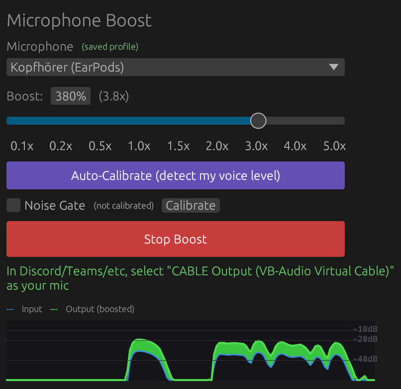

# Microboost

A Windows microphone booster that amplifies your mic for other apps (Discord, Teams, etc.) using a real-time audio pipeline through [VB-CABLE](https://vb-audio.com/Cable/) — a free virtual audio cable driver that creates a pair of connected audio devices (one for input, one for output) so audio can be routed between applications.



[Watch the demo on Loom](https://www.loom.com/share/8ebfbaf4b31f49fba5b1fdbee01ebd5f)

## How it works

```
Microphone → [capture] → gain × boost → noise gate → ring buffer → [playback] → VB-CABLE
                                                                                    ↓
                                                                Discord/Teams/Zoom picks up
                                                                "CABLE Output" as microphone
```

1. The audio driver delivers mic samples via an input callback
2. Each sample is multiplied by the boost factor (e.g. 2.0x) and clamped to [-1, 1]
3. If the noise gate is calibrated, quiet samples below the learned noise floor are faded to silence
4. Processed samples are written to a lock-free ring buffer (a circular array using atomic operations, so the input and output callbacks never block each other)
5. A separate output callback reads from the ring buffer and writes to VB-CABLE's virtual input
6. Apps like Discord see "CABLE Output" as a microphone and receive the boosted audio

On first launch, the app will offer to download and install VB-CABLE (free) automatically.

## Features

- Real-time microphone boost from 0.1x to 5x (10% to 500%)
- Auto-calibration: detects your voice level and sets the boost to YouTube-recommended loudness (~-16 dBFS)
- Noise gate: learns your background noise and suppresses it
- Live waveform visualizer: see input vs boosted output in real-time
- Per-microphone profiles: saves boost and noise gate settings per device
- Mic hot-plug detection: auto-switches when devices connect/disconnect
- Automatic VB-CABLE setup on first run
- Test recording and playback to verify your levels
- Lock-free audio pipeline (96.7 dB SNR)
- Native UI built with egui

## Installation

Download the latest release from the [Releases](https://github.com/alexeygrigorev/microboost/releases) page.

Or build from source:

```bash
git clone https://github.com/alexeygrigorev/microboost.git
cd microboost
make build
```

The executable will be at `target/x86_64-pc-windows-msvc/release/microboost.exe`.

> **Note:** The build requires the MSVC target (`x86_64-pc-windows-msvc`). The Makefile handles this automatically.

## Usage

1. Launch Microboost. If VB-CABLE is not installed, click "Install VB-CABLE" and accept the admin prompt.
2. Select your microphone from the dropdown.
3. Click "Auto-Calibrate" to detect your voice level, or manually set the boost.
4. Click "Start Boost" (or "Accept & Start" after calibration).
5. In your other app (Discord, Teams, etc.), select "CABLE Output" as the microphone input.

Use "Record Test" and "Play" to verify the boost sounds right before going live.

Recordings are saved to `%APPDATA%\Microboost\`.

## Requirements

- Windows 10 or later
- VB-CABLE (installed automatically on first launch, or get it from https://vb-audio.com/Cable/)

## Development

### Build

```bash
make build      # Build release (MSVC target)
make run        # Build and run
make open       # Open the built executable
make kill       # Kill running instance
make clean      # Clean build artifacts
make folder     # Open recordings folder
make rebuild    # Kill, rebuild, then run: make open
```

### Tests

Unit tests verify the audio pipeline produces identical output at 1x boost:

```bash
cargo test --release --target x86_64-pc-windows-msvc
```

Tests include:
- `passthrough_test` — verifies 1x boost is identity, 2x doubles signal, noise gate works, sample rate conversion is correct
- `cable_loopback` — sends a sine wave through VB-CABLE and measures distortion (requires VB-CABLE installed)
- `deep_compare` — sample-level cross-correlation comparison of pipeline output vs original (SNR, alignment)
- `quality_check` — automated quality analysis: clipping, noise floor, smoothness, frequency balance
- `spectral_check` — frequency band comparison across full recordings

End-to-end test tools (in `src/bin/`):
- `e2e_test` — feeds a WAV through the ring buffer + CABLE and compares direct vs ring buffer output
- `audio_test` — records simultaneously from a mic and CABLE Output for comparison
- `pipeline_test` — feeds a WAV through the full pipeline and records from CABLE

Run the e2e test (requires VB-CABLE):

```bash
cargo run --release --target x86_64-pc-windows-msvc --bin e2e_test
```

## Tech Stack

- [egui](https://github.com/emilk/egui) - Native GUI
- [cpal](https://github.com/RustAudio/cpal) - Audio capture and playback
- [hound](https://github.com/ruuda/hound) - WAV encoding/decoding
- [VB-CABLE](https://vb-audio.com/Cable/) - Virtual audio cable driver

## License

MIT
